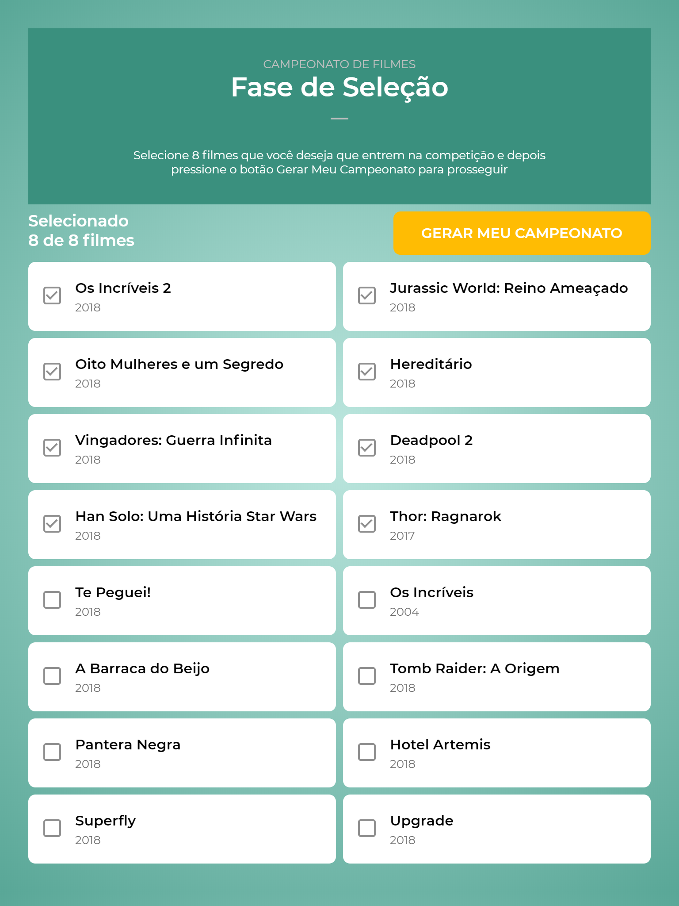
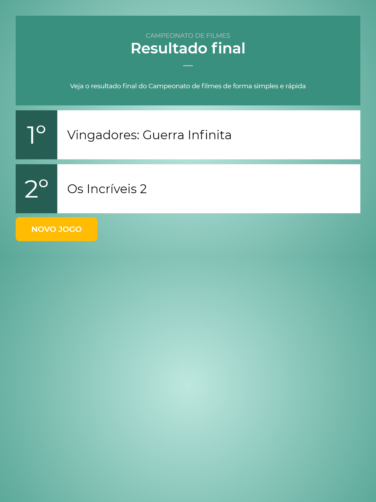

# Copa do Mundo dos Filmes
Escolha 8 filmes e veja qual ganha.

 

# Executar com docker
Dentro da pasta `CopaMundoFilmes` execute o seguinte comando: `docker-compose up -d`

# Executar sem o docker
Dentro da pasta `CopaMundoFilmes\API\CopaMundoFilmes.Api` execute o comando `dotnet run`

Dentro da pasta `CopaMundoFilmes\FRONT\copa-mundo-filmes` execute o comando `npm i` para instalar as dependencias. Depois execute o comando `npm start` para executar o sistema

# Uso
O site pode ser acessada no endereço http://localhost:3000

A api estará rodando em http://localhost:5000. Se acessar esse endereço, vai carregar o Swagger com os endpoins disponíveis
